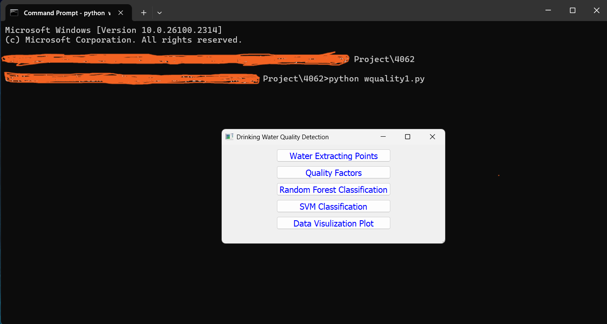
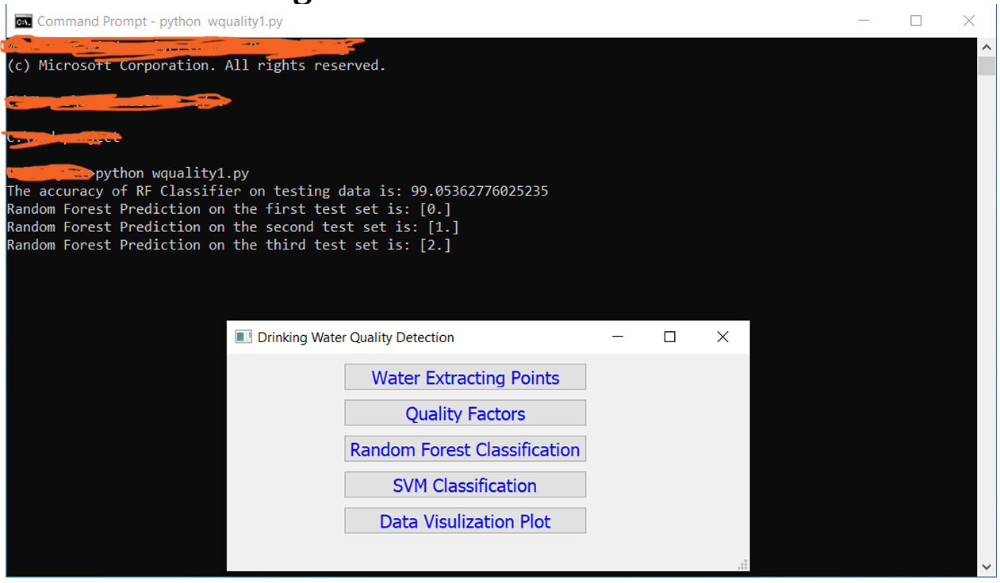

## RANDOM FOREST ALGORITHM:

  

  

It is found that random forest has achieved an accuracy of 99%. Three different test sets are used in order to show all the possible results. First test set has displayed the number 0 which means that the water has good quality, similarly for second and third the numbers 1 and 2 is displayed which refers to poor quality and very poor quality of water.  

## SUPPORT VECTOR MACHINE:

  

  

It is found that SVM has achieved an accuracy of 98%. Three different test sets are used in order to show all the results. First test set has displayed the number 0 which means that the water has good quality, similarly for second and third the number 1 and 2 are displayed which refers to poor quality and very poor quality of water.
